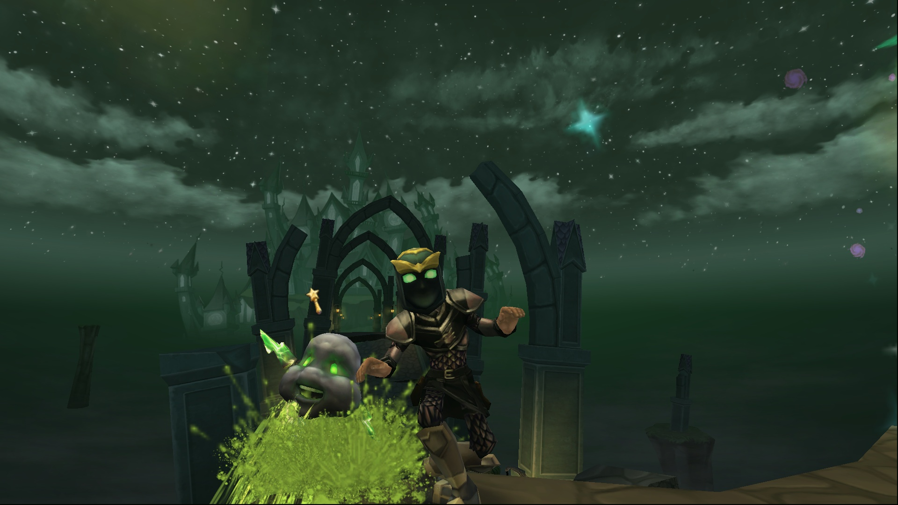

<h1 align="center">
  
</h1>

<h2 align="center">WizGallery is...</h2>

<strong>a Flask application powered by Next.js, designed to showcase my collection of Wizard101 game photos sourced from a local MySQL database. Utilized Docker to simplify testing, processing, and deploying the application locally.</strong></h4>

<pre align="center"> For any fellow Wizard101 Fans or OG's, try guessing the location of the logo above :P </pre>

## Tech Stack + How it Works

 \
The frontend is developed using `JavaScript` and the Next.js framework, with Tailwind CSS as the chosen `CSS` framework.

 \
The backend framework chosen for this project is Flask, a `Python`-based framework. In Flask, I create API endpoints to communicate with the frontend (the client).
These endpoints are designed for retrieving data from a MySQL database structure, which was made using the MySQL Community Edition Server (from their website).
This entire process resembles a RESTful API, employing HTTP methods such as GET for querying the database, and then returning JSON objects to the client.

Here is a breakdown:

- The API is structured around resources, with each endpoint representing a specific resource or set of data
  - An example of an 'endpoint' from the server is `http://localhost:5000/api/data`, which returns data in JSON format to the client
  - For the Flask API to receive information from the client, the client would send a query parameter on top of the endpoint like: `http://localhost:5000/api/search?location='{location}'`.
- Flask provides an easy way to map HTTP methods with specific functions and decorators
  - An example is: `@app.route('api/data', methods=['GET'])`. This is a decorator to signify that at the endpoint `api/data`, there is data to retrieve from the database using the `GET` method
  - The returned output to the client of the data is a JSON object. Flask simplifies this by: `return jsonify(some_data)`
  - For more information check out [api/server.py](https://github.com/andrearcaina/WizGallery/blob/main/backend/api/server.py)

 \
Git serves as the primary version control system for the project, enabling efficient tracking of code changes.
Docker, on the other hand, allows ease of access to local testing, processing, and deployment with containerization.
This ensures a seamless and reproducible environment.

## Functionality

> WizGallery is a full-stack web application designed to showcase a collection of Wizard101 game photos taken by me (andrearcaina).
> The key functionalities include:

- The app allows users to view a personal collection of Wizard101 game photos
- The app allows users to view based on certain parameters (like photos from a certain world/location)

## Future Updates/Ideas

Some updates/ideas to implement into WizGallery:

1. `Hosting`: Host it somewhere (maybe vercel)
2. `User photo submission`: Allow users to insert their own photos into the website
   - To implement this, can create a login and authentication page for security and personalization
   - The images processed need to be actual photos taken in Wizard101
3. `Photo showcase for users`: Allows users to check out their own photos that they uploaded
   - This is the main reason for the second point
4. `Cloud or Remote Database`: Benefits > Disadvantages
   - This can easily allow `CI/CD` implementation

## Concepts learnt

- `Docker`: How to use, what it does, and containerization
- `API's`: How to use, what it does, and different structures
- `Fetch`: How to use, what it does, and what it can do
- `MySQL`: How to use and what it does, alongside creating queries
